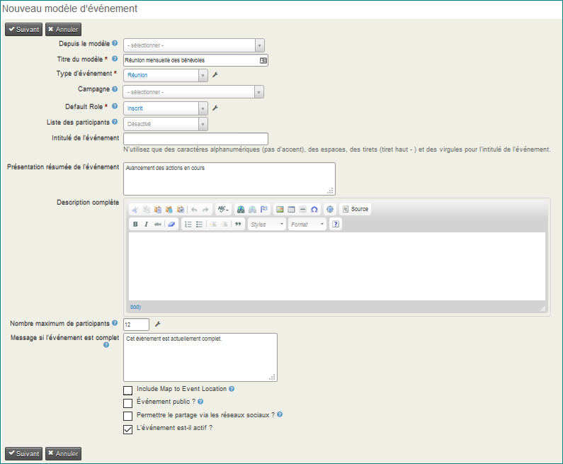

Modèles d'événements
====================

Si vous devez créér de nombreux événements avec des configurations semblables, il est possible de rationaliser et d'accélérer le processus de création à l'aide de modèles.

Les étapes de création de modèles d'événements sont similaires à celles décrites précédemment pour la création d'un événement. Les principales différences sont les suivantes:

-   Attribuez un titre de modèle descriptif qui identifie clairement le type d'événement utilisé pour ce modèle (par exemple, Réunion mensuelle des bénévoles avec inscription en ligne).
-   Il n'y a pas de dates de début et de fin dans le modèle. Ces informations seront toujours spécifiques à une instance d'événement réelle.

**Création d'un modèle d'événement**.

-   Pour créer un modèle, commencez par naviguer ici: **Événements> Modèles d'événements** et cliquez sur **Ajouter un modèle d'événement**. Saisir "le titre du modèle" ainsi que le type d'événement.
-   Sélectionnez une campagne si tous les événements créés à partir de ce modèle doivent être associés à une campagne.
-   Continuez de saisir les paramètres qui seront communs pour tous les événements à venir créés à l'aide de ce modèle.
-   Les caractéristiques communes peuvent inclure la localisation, les tarifs, les paramètres d'inscription en ligne,etc...

Une fois que vous avez créé un modèle d'événement, vous pouvez sélectionner ce modèle (comme illustré dans la capture d'écran suivante) lorsque vous créez un nouvel événement aux caractéristiques similaires. Votre événement sera pré-rempli avec les propriétés de la configuration enregistrée.

