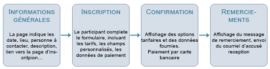
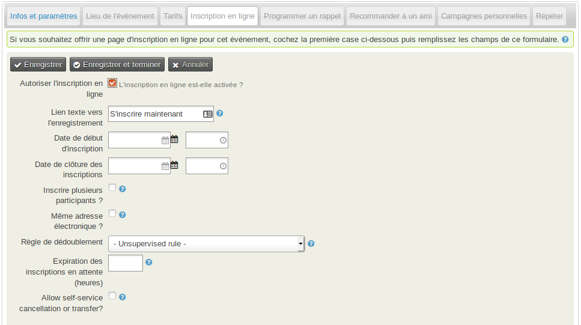
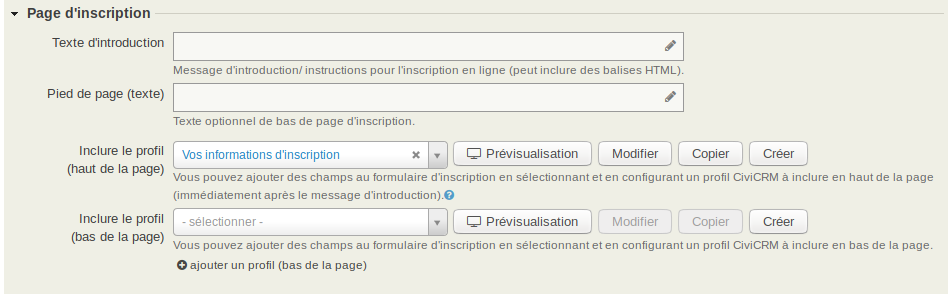
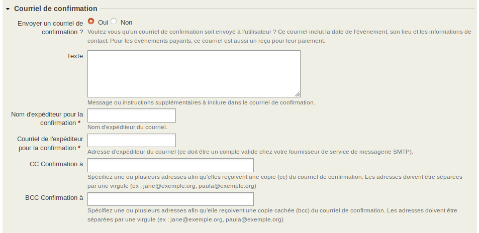
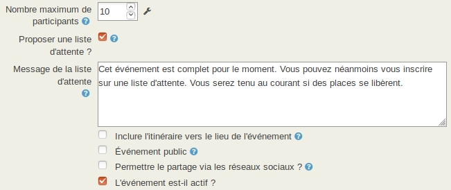

Inscription en ligne à un événement
===================================

La possibilité pour les utilisateurs finaux de pouvoir s'enregistrer eux-même à des événements est bénéfique pour tout le monde : les participants peuvent s'inscrire au moment le plus pratique pour eux, et votre organisation économise du travail administratif. Ce chapitre détaille les étapes impliquées à la mise en oeuvre des inscriptions en ligne pour des événements.

Le processus standard pour l'inscription en ligne à un événement est le suivant :

Paramétrer l'inscription en ligne
---------------------------------

Pour afficher les paramètres, cochez **Autoriser l'inscription en ligne**.

Confirmez ou modifiez le texte qui s'affichera en tant que lien vers la page d'inscription (par défaut, "S'incrire maintenant"), et indiquez les dates de début et de fin pour les inscriptions en ligne. Ces dernières définissent la période durant laquelle le formulaire d'inscription sera en ligne sur le site. Elle peut se terminer avant la date de l'événement lui-même, afin de vous laisser le temps de réaliser des tâches de préparation selon le nombre de participants.

Activer **Inscrire plusieurs participants** permet l'inscription et le paiement pour plusieurs personnes sur une seule transaction. Par exemple, vous organisez une conférence, et des personnes souhaiteront inscrire également leur partenaire et payer pour les deux en un seul processus.

Par défaut, cette option nécessite un nom et une adresse courriel différents pour chaque personne enregistrée. Cocher **Même adresse électronique ?** permet d'avoir une adresse commune. Dans les deux cas, CiviCRM utilise des enregistrements de contact distincts (soit existants, soit créés à la volée) pour chaque personne inscrite.

La **Règle de dédoublement** est expliquée plus loin dans la sous-section [Correspondance de contact et gestion des doublons](#correspondance-de-contact-et-gestion-des-doublons) de ce chapitre.

**Expiration des inscriptions en attente (en heure)** est le temps alloué aux participants pour confirmer / terminer leur inscription dont le statut est "en attente". Cela fonctionne avec la tâche programmée **Mettre à jour les statuts des participants** (voir **Administrer** > **Paramètres système** > **Travaux programmés**). Si l'un et l'autre sont activés, une inscription en attente doit être finalisée dans la période de temps spécifiée. Dans le cas contraire, l'inscription sera annulée et le participant notifié par courriel. Cette fonctionnalité est très utile lorsqu'elle est combinée avec les rappels automatiques pour gérer automatiquement les inscriptions *En attente de paiment*, si vous avez autorisé l'option de paiement sur votre formulaire d'inscription en ligne (cf le chapitre [Rappels programmés](../email/scheduled-reminders.md) de la section Courriel pour plus d'information).

L'étape suivante consiste à définir le texte et les champs servant à collecter les informations, et qui seront affichés dans la page d'inscription en ligne.

Le **Texte d'introduction** sera affiché en haut de la page, et le **Pied de page (texte)** en bas. Tous ou certains champs seront affichés entre les deux : profil, tarif, détail de la carte de crédit...

Collecter les informations sur les participants à l'aide des profils
--------------------------------------------------------------------

La meilleure façon de collecter de l'information durant une inscription en ligne est d'inclure un ou plusieurs profils dans la configuration de votre événement. Vous pouvez en mettre un immédiatement après le message d'introduction, et un ou plusieurs en dessous des tarifs et des détails de paiement (des informations détaillées sont disponibles dans le chapitre [Profils](../organising-your-data/profiles.md) de la section *Organiser vos données*).

Lorsque vous créez un formulaire d'inscription en ligne, le profil *Vos informations d'inscription* est sélectionné par défaut. Il consiste en trois champs : le prénom, le nom et l'adresse courriel. Toutefois, CiviCRM n'a besoin pour ses enregistrements de contact soit du prénom et nom, soit d'une adresse courriel. Vous pouvez donc modifier ce profil, ou en créer un nouveau requérant moins de champs. Si vous choisissez de ne pas collecter les adresses courriel, pensez à décocher l'option **Envoyer un courriel de confirmation ?** en bas.

ATTENTION : si vous modifiez un profil existant pendant le paramétrage de votre page d'inscription en ligne, le changement s'appliquera partout où ce profil est utilisé. Donc à moins qu'un profil existant ne corresponde *exactement* avec vos besoins, vous devriez plutôt faire la copie de l'un d'eux, le renommer, le modifier et enfin l'appliquer à votre page.

Une autre façon de faire est d'en créer un totalement nouveau, sans quitter la configuration de votre page d'inscription en ligne. L'interface *glisser-déposer* vous permet également de créer des champs personnalisés à inclure dans votre profil. Ces champs peuvent être créés pour tous ou certains types d'événements, et tous ou certains rôles de participants (cf. le chapitre [Données personnalisées](./custom-data-for-events.md) de cette section). 

Confirmation d'inscription
--------------------------

Une fois votre page d'inscription configurée, vous aurez besoin d'entrer le texte à afficher sur la page de confirmation, la page de remerciement, et envoyer par courriel les confirmations et accusés de reception (si vous en avez activé l'option).

Pour les événements gratuits, l'étape de confirmation est sautée. Pour les événements payants, le processus de paiement s'effectue entre la page de confirmation et celle de remerciement. 

Pour la plupart des événements, il sera utile d'activer l'option du courriel de confirmation. Pour les événéments payants, ce courriel sert également de reçu. Assurez-vous que l'adresse **Courriel de l'expéditeur pour la confirmation** soit un compte courriel valide de votre serveur de messagerie. Ajoutez une ou plusieurs adresses dans le champ **CC confirmation à** si vous souhaitez informer en temps réel des membres de votre organisation sur les participants.

Veuillez noter que le contenu du champ **Texte** sera généré en texte brut ET en HTML. Nous ne recommandons donc pas d'y inclure des tags HTML de formatage.

Fonctionnalités optionnelles d'inscription à un événement
---------------------------------------------------------

### Liste d'attente

Un événement peut accueillir un nombre limité de participants (par exemple, 25 personnes pour un atelier). CiviEvent vous permet de configurer un nombre maximum de personnes autorisées à s'inscrire à un événement. Lorsque ce nombre est atteint, CiviEvent désactivera les inscriptions mais enverra un message automatique disant "L'événement est actuellement complet". Vou pouvez personnaliser ce message, et configurer une liste d'attente de type "premier arrivé, premier servi".

Cette liste fonctionne de la manière suivante :

-   Quand une place se libère (par exemple lorsqu'une personne annule son inscription), la première personne en liste d'attente aura le statut changé en *En attente (depuis la liste d'attente)* et un courriel automatique lui sera envoyé avec un lien lui permettant de compléter son inscription (y compris la méthode de paiement si applicable).
-   Cette personne restera avec ce statut pendant le temps défini dans la configuration (voir plus haut la rubrique "Paramétrer l'inscription en ligne"). Cela correspond à une fenêtre durant laquelle elle aura l'opportunité de s'inscrire. Une valeur à 0 correspond à une période illimité.
-   À l'expiration de la période, le statut passera à *Expiré* et le processus reprendra pour la personne suivante de la liste d'attente.

Si vous souhaitez utiliser la fonctionnalité de liste d'attente, vous devez :
-   Activer (pré-requis) les status des participants *Sur liste d'attente* et *En attente (depuis la liste d'attente)*. Vous pouvez le faire en allant à **Administrer** > **CiviEvent** > **Statut de participant** ;
-   Dans la page de configuration de l'événement, onglet *Infos et paramètres*; les options **Proposer une liste d'attente** et le texte du message seront disponibles. Activez-les et modifiez le texte le cas échéant ; 

Notez que le processus ne peut fonctionner que si la tâche programmée *Mettre à jour les statuts des participants* est en cours d'exécution (voir **Administrer** > **Paramètres système** > **Travaux programmés**).

### Approbation d'inscription

Dans certains cas, les événements ne seront ouverts que pour des personnes particulières (par exemple pour les donateurs de sommes importantes). Si tout le monde peut accéder à la page d'inscription, CiviEvent permet néanmoins aux organisateurs de vérifier la liste des personnes qui se sont "pré-inscrites" et de valider définitivement leur participation.

Pour activer cette fonctionnalité, vous devez :
-   Activer (pré-requis) les status des participants *En attente de validation*, *En instance de validation* et *Rejeté*. Vous pouvez le faire en allant à **Administrer** > **CiviEvent** > **Statut de participant** ;
-   Dans la page de configuration de l'événement, onglet *Inscription en ligne*; les options **Requiert la validation de l'inscription** et **Message de validation** seront disponbiles pour activation et configuration.

Dorénavant, lorsqu'une personne s'enregistrera pour l'événément, elle recevra une réponse disant "Votre inscription a été transmise. Quand votre demande d'inscription aura été vérifiée, vous recevrez un courriel contenant un lien vers la page où vous pourrez terminer votre inscription". Cette réponse peut être personnalisée selon vos besoins.

Le statut de la personne sera "En attente d'approbation". Vous pouvez parcourir et confirmer les demandes de participation en allant à **Événements** > **Rechercher des participants**. Sélectionnez la tâche *Changer le statut des participants*. Le statut des participants validés passera en « En attente suite à validation », et les participants recevront un courriel contenant un lien pour compléter leur inscription (y compris le paiement des frais d'inscription à l'événement - s'il y en a). 

Notez que le processus ne peut fonctionner que si la tâche programmée *Mettre à jour les statuts des participants* est en cours d'exécution (voir **Administrer** > **Paramètres système** > **Travaux programmés**).

### Pages personnelles de campagne

Si vous avez activé les pages personnelles de campagne, vous offrez la possiblité aux personnes inscrites à un événement la possiblité de créer et de personnaliser une page qui leur est propre pour :
-   soit promouvoir l'événement pour lequel elles sont inscrites ;
-   soit promouvoir la page d'inscription en ligne.

Pour plus d'information, veuillez vous référer au chapitre [Pages personnelles de campagne](../contributions/personal-campaign-pages.md) de la section *Contributions*.

Il s'agisssait de la dernière étape de création d'un événement. Clqiuez sur **Enregistrer et terminer**.

Correspondance de contact et gestion des doublons 
-------------------------------------------------

À partir du moment où des personnes interagissent avec la base de donnée CiviCRM depuis l'extérieur (par l'intermédiaire des auto-inscription en ligne), nous courons le risque de créer des doublons de contact. Il existe plusieurs possibilité pour gérer cela. Par exemple, nous pouvons afficher le formulaire d'inscription en ligne uniquement pour les personnnes déjà authentifée sur le site web de votre organisation, en jouant sur les permissions. Mais cela n'est peut-être pas une bonne idée si vous souhaitez ouvrir un événement au grand public, et non pas uniquement aux personnes enregistrées dans votre base.

Nous avons vu plus qu'une personne inscrite à un événement était automatiquement enregistrée dans la base des contacts si celle-ci n'existait pas encore. Mais que se passe-t-il si, par exemple, Dominique Snow vivant à Londres s'inscrit alors que nous avons un contact Dominique Snow vivant à Paris ? C'est ici que les règles de dédoublement entre en jeu.

Vous pouvez en apprendre davantage sur les règles de dédoublement dans le chapitre [Dédoublonner et fusionner](../common-workflows/deduping-and-merging.md). Ici, nous ne couvrirons le sujet que dans le contexte de CiviEvent.

Par défaut, CiviEvent utilise la règle *automatique* pour établir les correspondances. Lorsque vous configurez la page d'inscription en ligne d'un événement, vous pouvez choisir une règle différente de celle par défaut pour cet événement particulier.

L'onglet *Inscription en ligne* vérifie si les profils inclus ont assez de champs pour permettre de faire des comparaisons et détecter des doublons. L'alerte *Détection de doublon impossible* apparait si la règle et les champs disponibles ne permettent pas de réaliser suffisamment de comparaisons, tandis que l'alerte *Détection de doublon possible* apparait si tous les champs sont là, y compris ceux qui ne sont pas nécessaires aux comparaisons.

Permissions d'inscription
-------------------------

Si vous avez activé l'inscription en ligne sur votre site web, vous aurez besoin de configurer vos permissions Drupal pour vous assurer que vos visiteurs puissent visualiser la page de l'événement et celle de son inscription. Allez à **Administrer** > **Utilisateurs et permissions** > **Permissions (contrôle d'accès)**, puis cliquez sur **Contrôle d'accès Drupal**.

La plupart des organisations autorisent les visiteurs anonymes (ceux que ne se sont pas connectés) à voir et s'inscrire aux événements. Si vous voulez permettre cela, vous devez assigner au module CiviCRM les permissions suivantes pour le rôle *Utilisateur anonyme* :

-   *CiviCRM: accéder à toutes les données personnalisées* - requis si vous collectez des informations depuis des champs personnalisés ;
-   *CiviCRM: Création de profils* - requis si vous incluez un profil dans vos formulaires d'inscription ;
-   *CiviEvent: s'inscrire à des événements*
-   *CiviEvent: afficher les informations sur l'événement*
-   *CiviEvent: afficher les participants à l'événement* - requis si vous souhaitez afficher une liste des participants inscrits à l'événement ;

Si vous souhaitez exclure les utilisateurs anonymes, assignez ces permmissions au rôle *Utilisateurs authentifié*.

CiviCRM possède un système de permission supplémentaire connu sous le nom de *Access Control Lists (ACLs)*. ACLs vous permet de contrôler les accès aux données CiviCRM. Veuillez noter que ce système n'est pas lié aux rôles Drupal.
Pour plus d'information, veuillez vous référer au chapitre [Autorisations et contrôle d'accès](../initial-set-up/permissions-and-access-control.md).

Si vous avez besoin de limiter les accès à des événements particuliers, vous pouvez utiliser la fonctionnalité *Gérer les contrôles d'accès* pour assigner les accès à des groupes spécifiques de contact.

Testing the registration process
--------------------------------

Before revealing your event to the public, you should always test the
event registration process. This can be done as follows:

1.  Navigate to **Events > Manage Events**.
2.  From Event Links, select **Test-drive** to test the registration
    page. Test-drive mode will use the sandbox options for your payment
    processor, if available, and will create a registrant record with a
    test indication so that it can be reviewed and easily removed.
3.  Fill out the registration form and complete the registration
    process.
4.  In order to find the new test participant record, navigate
    to **Events > Find Participants**.
5.  In the search criteria, check the box **Find Test Participants**.
6.  If you need to adjust the event settings, navigate to **Events > Manage Events** and click the **Configure** link for this event.
7.  If you discover elements that you need to edit and adjust,
    select **Configure** to return to the list of event setting pages.
8.  If you have events where anonymous users register for events, you
    should also test the registration when not logged in. Refer to the
    Event Permissions information later in this chapter for details.

Once you are satisfied with the event information and registration form,
it's time to display it on your website. Below are details of how to do
this.
