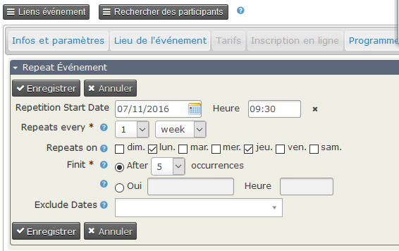

Événements récurrents
=====================

Vous pouvez définir une série d'un même événement qui va se reproduire plusieurs fois certains jours et heure avec une date de fin spécifique et y inclure des dates à exclure de cette série. Exemple : le mardi pendant 6 semaines ou le mercredi tous les mois sauf vacances scolaire

Pour accéder à la répétition des événements aller  à  **Gestion des événements**, puis selectionner **Configurer** à droite de l'événement et cliquez sur **Répéter** dans le menu déroulant.

**Ecran répéter l'événement**

Dès que vous êtes dans l'écran **Repeat Event**, vous devez spécifier les intervalles de répétition (en heures, jours, semaines, mois ou années) et la date de fin de l'événement. Cependant, il est fortement recommandé de spécifier la date de début de la répétition et les dates exclues.

**Remarque:** Si vous souhaitez que vos rappels programmés se répètent, assurez-vous que vous avez configuré les rappels programmés sur l'événement que vous répétez, vous pourrez le modifier ultérieurement. Il est également recommandé de ne pas configurer vos rappels de répétition les jours spécifiques prévus, mais plutôt de les envoyer deux semaines ou quelques jours avant l'événement.

Une fois que vous avez rempli tous les champs appropriés, cliquez sur **Enregistrer** pour enregistrer votre sélection. Vous aurez une fenêtre popup qui vous invitera à **Continuer** votre sélection.

