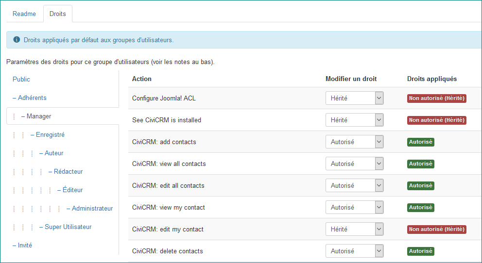
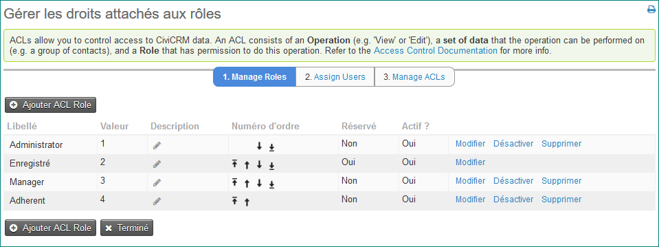

Autorisations et contrôle d'accès
=================================

Les autorisations (concept connexe de listes de contrôle d'accès ou ACL) sont des ensembles de règles qui définissent l'accès à différentes zones d'action du système. Pratiquement, vous créez des rôles pour votre site, donnez à ces rôles des autorisations pour effectuer certaines tâches et affectez les rôles à certaines personnes autorisées.

Les autorisations et les listes de contrôle d'accès vous permettent d'accéder à:

-  Différents composants de CiviCRM (par exemple : CiviContribute, CiviCase et CiviMail) pour permettre les tâches dont l'utilisateur est responsable 
-  Les données au sein du système (par exemple : les contacts, les contributions, etc.) et comment l'utilisateur peut interagir ou opérer avec elles.(créer, voir, modifier, supprimer)

Comme les permissions définissent qui peut voir et agir sur votre site, il est important, d'un point de vue de sécurité de bien les comprendre. Il est très facile de vérifier un paramètre d'autorisation sans comprendre complètement ce qu'il fait. Un site avec des autorisations mal configurées peut exposer par inadvertance les données de vos contacts.

Quelles différences entre les autorisations CMS et les ACL CiviCRM ?
------------------------------------------------------------------

Les autorisations et les ACL sont définis en deux endroits distincts: dans le système de gestion de contenu (CMS) et dans CiviCRM lui-même. De nombreuses organisations peuvent faire simplement avec les autorisations du CMS. D'autres doivent utiliser les ACL de CiviCRM pour obtenir un contrôle d'accès plus précis.

Les autorisations CMS vous permettent d'accorder (ou non) l'accès à des sections entières de CiviCRM ainsi qu'à des rôles d'utilisateurs tels que CiviMail, CiviEvent, etc... Elles permettent également de restreindre la capacité de l'utilisateur à afficher, éditer, ajouter et supprimer des enregistrements tels que des contacts , événements et contributions. Cependant, il s'agit d'une approche «tout ou rien»: vous ne pouvez pas différencier les contacts qui sont dans différents groupes, par exemple :

Les ACL CiviCRM natives donnent un contrôle plus précis, ainsi vous pouvez limiter l'accès pour afficher, modifier, créer, supprimer et rechercher dans:

-   Les goupes et les contacts
-   Un profil (il s'agit d'une serie de champs existants et/ou personnalisés, voir "*Profils*")
-   Un ensemble de champs personnalisés
-   Certains événement (Par exemple, un utilisateur peut accéder à un événement, mais pas à d'autres)

En règle générale, vous pouvez commencer avec les autorisations CMS et si vous ne pouvez pas faire ce que vous souhaitez, configurez alors les ACL de CiviCRM pour renforcer plus précisement les droits d'accès.

Pour clarifier, voici deux exemples d'instances où les listes ACL de CiviCRM devraient être utilisées plutôt que celles de Drupal, Joomla! Ou WordPress:

1.  Une organisation a un siège social, et trois bureaux régionaux répartis à travers le pays. Le responsable des événements travaillant à partir du bureau central doit être en mesure de visualiser tous les événements à travers chaque bureau. Chaque bureau régional est seulement autorisé à accéder à ses propres événements pour voir et modifier. Étant donné qu'une liste de contrôle d'accès CMS ne peut restreindre l'accès aux événements pour voir/modifier/ajouter/supprimer, *une ACL CiviCRM doit être utilisée.*

2. Deux ensembles de champs personnalisés ont été crées, l'un pour une équipe d'employés travaillant à Paris et un autre pour les donateurs à Londres. Chaque équipe doit uniquement pouvoir accéder aux données contenues dans son propre ensemble de champs personnalisés. Une liste de contrôle d'accès CMS ne peut leur donner accès qu'à toutes les informations personnalisées, ou à aucune d'entre elles. Dans ce cas, toute règle CMS contrôlant l'accès aux champs personnalisés doit être désactivée et une ACL CiviCRM doit être utilisée.

Autorisations CMS 
-----------------

Tous les CMS possèdent le même ensemble d'autorisations de CiviCRM, mais chacun se trouve dans des endroits différents et diffère légèrement en apparence.

### Autorisations dans Drupal

Pour acceder aux autorisation Drupal allez au menu Drupal et choisissez l'option **People** et cliquez sur l'onglet **Permissions** dans le coin supérieur droit de la fenêtre popup. Vous trouverez ici une liste de toutes les opérations ou actions possibles qu'un utilisateur peut effectuer dans CiviCRM et Drupal, avec des colonnes pour chaque type de rôle existant. La vérification d'une option dans l'une des colonnes confère à ce rôle la capacité d'exécuter l'action.
Vous pouvez créer de nouveaux rôles et modifier ceux déjà existants. Pour modifier les rôles, dans l'onglet **Permis**, cliquez sur le bouton **Rôles** en haut à droite de la page.

 

Les rôles peuvent être attribués aux utilisateurs de la manière suivante:

- Ouvrez l'enregistrement de contact d'un utilisateur (un contact dans CiviCRM avec un compte d'utilisateur), appuyez sur le bouton **Actions** en haut et sélectionnez **Enregistrement utilisateur** dans le menu. Lorsque l'écran suivant apparaît, cliquez sur l'onglet **Modifier** (en haut à droite), puis faites défiler la page vers la section intitulée **Rôles**, vous pourrez alors changer leur niveau d'accès.

- En tant qu'administrateur, accédez au menu Drupal et sélectionnez l'option **Personne**. Lorsque la liste des utilisateurs actifs s'affiche, cliquez sur le nom souhaité pour ouvrir leur profil utilisateur Drupal, accédez à l'onglet **Modifier** en haut à droite de la page, puis faites défiler jusqu'à la section **Rôles**.

### Autorisations dans Joomla!

Les autorisations dans Joomla! peuvent être trouvées comme suit:

1.  Connectez-vous à Joomla! en tant qu'administrateur. Vous accedez au Panneau d'administration : choisir **Configuration**
2.  Dans la liste des **Composants** sélectionnez **CiviCRM** 
3.  Lorsque l'écran suivant apparaît, cliquez sur l'onglet **Droits**, vous pourrez alors changer les niveaux d'accès.
4.  Une fois les modifications effectuées cliquez sur **Enregistrer et fermer** en haut à gauche. 

Joomla! a une méthode différente d'attribution des autorisations. Les droits d'accès des différents groupes dans Joomla sont organisés de manière hiérachique, chaque groupe héritant des droits de son parent. Chaque groupe d'utilisateurs (rôle) est un parent ou un enfant d'un autre groupe d'utilisateurs. Les groupes d'utilisateurs enfants (ceux de la table inférieure) héritent des autorisations définies pour les groupes au-dessus d'eux. Par conséquent, lors de la modification des autorisations attribuées à un groupe d'utilisateurs dans la table, vous pouvez choisir entre:

-   **Hérité**: Si le groupe d'utilisateurs supérieur a cette autorisation, il sera également en mesure d'effectuer l'action donnée
-   **Autorisé**: Les utilisateurs de ce groupe sont autorisés à effectuer l'action. 
-   **Non autorisé**: Les utilisateurs de ce groupe ne peuvent pas effectuer l'action

Notez que Joomla! a deux autorisations supplémentaires non utilisées par Drupal ou Wordpress: **Configurer Joomla! ACL** (l'utilisateur peut configurer les listes ACL de Joomla! affectées à toutes les autorisations CiviCRM) et **See CiviCRM is installed** (l'utilisateur peut voir CiviCRM dans la liste des Composants).

 

Pour affecter un de ces groupes à un utilisateur ou pour modifier son groupe existant, assurez-vous d'être connecté en tant qu'administrateur, puis effectuez l'une des opérations suivantes:

-   Accédez à l'enregistrement de contact de l'utilisateur dans CiviCRM, cliquez sur le bouton **Action** et sélectionnez l'option **Group add contacts** Il suffira de sélectionner le groupe et valider par **Ajouter au groupe** 

-   Dans l'administration de Joomla!, sous le menu **Utilisateur** tous les utilisateurs disponibles y sont répertoriés. En cliquant sur un nom, vous ouvrez un écran avec la possibilité de modifier les paramètres de leur compte, y compris le groupe d'utilisateurs : **Attribuer cet utilisateur à un ou plusieurs groupe**. N'oubliez pas de cliquer sur **Enregistrer et fermer**

### Contrôle d'accès (autorisations) dans Wordpress

Dans CiviCRM, allez dans **Administer**> **User and Permissions**> **Permis (Access Control)**. Sélectionnez le lien **Wordpress Access Control**. Vous pouvez ajuster ici les paramètres CiviCRM pour chacun des rôles utilisateur prédéfinis de Wordpress.

Les rôles peuvent être attribués aux utilisateurs de la manière suivante:

-   Ouvrez l'enregistrement de contact d'un utilisateur (un contact dans CiviCRM avec un compte d'utilisateur), appuyez sur le bouton **Actions** en haut et sélectionnez **Enregistrement utilisateur** dans le menu. Cela ouvrira l'écran **Modifier l'utilisateur** où vous pouvez modifier leur **Rôle** pour changer leur niveau d'accès.

-   Dans la zone Administrateur du site WordPress, sélectionnez l'élément de menu **Utilisateurs** pour afficher la liste de tous les utilisateurs. En cliquant sur un nom, vous ouvrez l'écran **Modifier l'utilisateur** où vous pouvez changer leur **Rôle** et modifier leur niveau d'accès.

### Rôles anonymes et authentifiés

Vous rencontrerez ces deux types de rôle lorsque vous travaillez avec les contrôles d'accès. Bien qu'ils puissent être nommés différemment suivant les CMS, le principe de base est le même.

Le rôle **Anonyme** (**Public** dans Joomla!) s'applique à tous les visiteurs du site Web qui ne sont pas enregistrés. Ce rôle aura le niveau d'autorisation le plus bas. Les autorisations CiviCRM par défaut pour ce rôle sont les suivantes:

-   Souscrire à des contributions ou des dons en ligne
-   Afficher les informations sur les événements 
-   S'nscrire à des événements grâce à des formulaires en ligne
-   Voir la liste des participants à un événement
-   S'abonner et se désabonner des listes de diffusion
-   Accéder aux données personnalisées (seulement voir/saisir des informations dans les champs de données personnalisés des formulaires)
-   Accéder aux fichiers téléchargés (c'est-à-dire afficher/imprimer le contenu des fichiers téléchargés)
-   Afficher, créer et modifier des profils (ou des listes de profils et des formulaires)

Le rôle **Authentifié** (**Enregistré** dans Joomla, **Abonné** dans WordPress) est appliqué à tous les visiteurs du site qui ont ouvert une session. Il s'agit du rôle par défaut pour tous les nouveaux comptes d'utilisateurs et ne peut pas être supprimé. Par défaut, les autorisations CiviCRM pour ce rôle sont identiques à celles du rôle **Anonyme**.

Vous pouvez modifier les autorisations pour les utilisateurs anonymes et authentifiés, si nécessaire, en fonction des scénarios courants suivants :

#### Saisie de contributions en ligne
Si vous souhaitez seulement que les utilisateurs enregistrés puisse payer leurs contributions alors vous supprimez la permission de **make online contributions** du rôle «anonyme» ou «public».

#### Affichage et inscription aux informations sur les événements  
Si "afficher les informations sur les événements" et "s'inscrire aux événements" est activé pour les rôles anonymes et authentifiés, tous les visiteurs de votre site pourront s'inscrire à n'importe quel événement. Si vous souhaitez donner qu'à des utilisateurs spécifiques la possibilité de voir ou de s'inscrire à *certains* événements, vous devez utiliser une ACL CiviCRM pour créer un rôle "afficher" pour l'accèder aux événements, pour afficher uniquement les informations propres aux événements et modifier "l'autorisation" s'ils veulent s'inscrire. Toutefois, pour que cela fonctionne, dans le  CMS l'autorisation ACL "CiviEvent: register for events"  doit être désactivé, sinon ceci va remplacer les paramètres de Civicrm.

>Par exemple : Un organisme de bienfaisance tient occasionnellement des événements de collecte de fonds pour le public et des dîners de galas pour certains de ses donateurs institutionnels. Tout visiteur du site peut s'inscrire et participer à une activité de collecte de fonds, mais les dîners sont privés et ne doivent être disponibles que pour certains de leurs bienfaiteurs. Dans ce cas, les listes ACL CiviCRM doivent être utilisées à la place de la règle CMS : "register for events" car elles doivent spécifier les événements particuliers auxquels chaque groupe d'utilisateurs peut accéder.

#### Modification de données de profil dans des formulaires en ligne
Les profils sont des séries de champs par défaut et personnalisés qui peuvent être utilisés dans des formulaires en ligne pour recueillir des informations supplémentaires auprès des visiteurs ou créer des répertoires consultables (voir «Profils»).

Si vous avez un profil particulier dans un formulaire en ligne, utilisé pour rechercher et modifier des données dans CiviCRM (par exemple ne faisant pas partie d'une page d'enregistrement d'événements), seuls les utilisateurs authentifiés peuvent les modifier. L'autorisation "modification de profil" peut être donnée au rôle anonyme, mais les visiteurs qui ne sont pas connectés ne seront toujours pas en mesure de modifier les données à moins qu'ils aient une URL unique sur une page où ils peuvent modifier leurs propres données.( Consultez "Tâches quotidiennes" dans la section "e-mail" pour plus d'informations). 
Pour modifier, les utilisateurs anonymes doivent avoir la permission de "modifier profil".

#### Collecte de données provenant de visiteurs anonymes utilisant des profils 

Si vous avez créé des profils pour collecter des données auprès de visiteurs anonymes via des formulaires en ligne (par exemple, des pages d'inscription d'événement, des pages de contribution et des formulaires de profil autonomes), l'autorisation "création de profil" devra être attribuée au rôle "anonyme". En outre, si le profil contient des champs personnalisés, une autorisation supplémentaire devra être donnée, selon les circonstances. Lisez «Accès aux données personnalisées» ci-dessous.

#### Création de listes consultables par le public

Les profils peuvent être utilisés pour créer des listes consultables, par certains critères de recherche capables de rassembler une liste de résultats de la base de données (par exemple, trouver des organisations stockées dans la base de données par localisation, code postal, ville). Si vous souhaitez donner accès à un groupe d'utilisateurs aux pages de recherche publiées sur le site Web, cochez l'option "profil" pour ce groupe de rôles / utilisateurs.

#### Voir les Profils

Lorsque des profils ont été incorporés dans des pages en ligne (par exemple pour afficher le nom d'une organisation, la description et les coordonnées dans la base de données), le visiteur doit avoir l'autorisation «vue profil» pour les voir.

#### Utilisation de l'autorisation "Profile listings and forms"

Ce droit d'accès doit être attribué avec soin et uniquement aux rôles de confiance. L'autorisation donne accès à:

-   Ajouter des données via des profils dans les formulaires en ligne
-   Modifier les données affichées dans les profils sur les pages publiques si l'option est donnée (par exemple, les informations de contact)
-   Utilisez des listes publiques consultables

Dans la mesure du possible, chacun de ces droits d'accès doit être attribué à un rôle séparé, et non à l'autorisation «Autoriser toutes les actions». Par défaut, les «listes et formulaires de profil» ne sont pas activés pour les rôles «anonyme» et «authentifié».
Notez que si ce rôle a été donné à des utilisateurs anonymes, afin de modifier des données, le visiteur doit soit être connecté ou utiliser un jeton de somme de contrôle (voir "Tâches quotidiennes" dans la section sur le courrier électronique).

#### Accès aux données personnalisées

Si des champs de données personnalisés ont été utilisés sur un formulaire en ligne ou dans des profils, l'utilisateur ne pourra pas interagir avec lui, à moins d'avoir reçu l'autorisation de visualiser et/ou de modifier des données personnalisées. Il y a deux façons d'attribuer cette capacité:

1. Activez l'autorisation "accéder à toutes les données personnalisées" en fonction des rôles que vous souhaitez donner à la fois d'affichage et d'édition. Par exemple, on pourrait afficher et modifier tous les champs personnalisés dans des formulaires en ligne (exemple : des champs de données personnalisés dans un profil qui ont été incorporés dans une page d'enregistrement d'événement). Cependant, il s'agit d'une approche «tout ou rien».

2. Autrement, les ACL CiviCRM peuvent être créées pour donner un rôle d'accès uniquement à des ensembles *spécifiques* de champs de données personnalisés. Utilisez cette option lorsque vous souhaitez donner à des groupes d'utilisateurs un accès à différents ensembles de données. Par exemple : Une équipe à Amsterdam ne peut avoir accès à des champs de volontaires personnalisés, tandis que le siège social en Ecosse a accès à des champs de bénévolat personnalisés et des champs de donateur personnalisés. Notez que ces listes ACL ne fonctionneront pas si l'autorisation "accéder à toutes les données personnalisées" est utilisée dans le CMS. Cette permission dans Drupal ou Joomla remplacera ces paramètres dans CiviCRM.

#### Accès aux fichiers téléchargés

Activez l'autorisation "Accéder aux fichiers téléchargés" pour tout rôle qui doit afficher les images, les photos et les documents attachés aux contacts et aux pages CiviCRM. Veillez à attribuer cette autorisation au rôle «anonyme» si vous souhaitez que les visiteurs puissent voir les photos attachées aux dossiers des contacts, aux pages de campagne personnelle, aux documents destinés à l'utilisation publique, etc...

#### Donner aux utilisateurs la possibilité d'afficher leur tableau de bord de contact

Vous pouvez autoriser, aux utilisateurs authentifiés (connectés), un accès à un écran où ils peuvent consulter les groupes de diffusion auxquels ils ont souscrit, leurs contributions, leurs événements, leurs adhésions et leurs inscriptions (le cas échéant). Affectez l'autorisation "Accès au tableau de bord de contact" aux rôles auxquels les utilisateurs peuvent avoir accès à cette fonctionnalité. **Ne pas** activer ceci pour le rôle "anonyme".

### Autres Rôles des CMS 

Chaque CMS a également d'autres rôles prédéfinis donnant plusieurs variables d'accès à CiviCRM. Vous pouvez encore modifier les autorisations accordées à ces rôles, mais vous devez vous assurer qu'il existe toujours un rôle (Administrateur / Utilisateurs super / Administrateur) capable d'administrer CiviCRM, y compris la gestion du contrôle d'accès.

Vous pouvez également ajouter des rôles supplémentaires pour permettre un accès très gradué à la fonctionnalité CiviCRM.

Vous trouverez plus d'informations sur les autorisations CiviCRM (options de contrôle d'accès) incluant les autorisations requises pour effectuer certaines fonctions de back-office ici : [http://wiki.civicrm.org/confluence/display/CRMDOC/Default+Permissions+and+Roles](http://wiki.civicrm.org/confluence/display/CRMDOC/Default+Permissions+and+Roles).

Fonctions natives des ACL de CiviCRM
------------------------------------

Comme indiqué précédemment, les listes ACL de CiviCRM constituent une manière plus avancée et plus précise de gérer l'accès des utilisateurs aux enregistrements par l'intermédiaire de groupes de contacts affectés aux rôles ACL. Alors qu'un contrôle d'accès dans le CMS peut «désactiver» la visibilité de sections entières de CiviCRM et déterminer si un utilisateur peut afficher / éditer / supprimer / créer des données dans les différentes zones du système, il ne peut subdiviser ces règles pour accéder à différents types d'enregistrements. Par exemple:

> Un organisme de bienfaisance basé à Paris a trois bureaux régionaux et doit donner à son personnel chargé de la collecte de fonds la possibilité de créer et d'éditer des dossiers de contact pour les donateurs potentiels. La direction a décidé que le service de collecte de fonds de chaque bureau régional ne peut avoir accès qu'à ses propres contacts locaux. Alors que l'autorisation "ajouter des contacts" peut être accordée aux utilisateurs authentifiés dans le CMS (Drupal, Joomla! Ou WordPress), si "voir tous les contacts" et "modifier tous les contacts" avait également été attribués de cette manière, il n'y aurait aucun moyen de différencier les trois groupes de donneurs selon leur lieu. Cela ne peut être réalisé qu'avec une ACL CiviCRM.

Pour commencer, allez dans **Administer**> **Utilisateur et Permissions**> **Permisssion (Contrôle d'accès)**. Cet écran vous permettra d'arriver à la liste de contrôle d'accès CMS, et les trois étapes à la gestion propre à CiviCRM :

### 1 - Gérer les rôles
C'est ici que vous pouvez créer des rôles ACL. Par défaut, il existe "Administrateur" et "Enregistré" (connecté), mais seul le rôle d'administrateur peut être édité. «Enregistré» est un rôle réservé et de base pour le système.

Cliquez sur "Add Acl Role"  pour afficher un écran qui permettra de créer un nouveau rôle avec les options suivantes:

-   **Label**: Indiquez le nom du rôle qui sera visible aux utilisateurs
-   **Valeur** :  Le changement de ce champ va dissocier les enregistrements qui référencent cette option. Ce changement ne peut être annulé excepté en restaurant la valeur précédente.
-   **Description**: Saisissez une description précise du rôle
-   **Poids**: Donner au rôle un nombre pour déterminer sa place dans la liste (par exemple, "1" place le rôle en haut, tandis que "20" peut l'envoyer en bas de la liste. Les nombres inférieurs apparaissent avant ceux plus élevés)
-   **Actif?**: le rôle est-il actif ou non? Si vous désactivez cette option, la fonctionnalité cesser de fonctionner pour certains utilisateurs

### 2 - Assigner des utilisateurs aux rôles ACL de CiviCRM

Dès que les rôles sont créés vous pouvez commencer à les affecter aux utilisateurs. Dans CiviCRM, cela se fait en deux étapes:

Créez d'abord un groupe de contrôle d'accès pour une sélection d'utilisateurs qui doivent avoir le même niveau d'accès. Il existe plusieurs façons de le faire, décrites dans le chapitre «Groupes et tags».

Le groupe de contacts ACL peut maintenant être affecté à un rôle. Cliquez sur la deuxième étape de l'écran du menu de contrôle d'accès («Attribuer des utilisateurs aux rôles ACL de CiviCRM») et cliquez sur «Assigner des rôles aux utilisateurs». Remplir le formulaire suivant:

-   **Rôle ACL**: Sélectionner un rôle ACL disponible
-   **Assigné à**: Choisissez un groupe de contacts à affecter au rôle
-   **Actif?**: Cette affectation est-elle active ou non?

 

### 3 - Gérer les ACL

La troisième étape est l'endroit où les ACL sont finalement créées. On peut les décomposer en les questions suivantes:

1.  Quel rôle aura la permission pour effectuer cette action?
2.  Quelle est l'action ou opération? Aura-t-il la possibilité de visualiser / éditer / supprimer / créer, etc?
3.  A quel ensemble de données l'action peut-elle être attribuée?

Pour commencer à créer ces ACL, retournez à l'écran "Contrôle d'accès"  (**Administrateur> Utilisateur et Autorisations> Permissions ... **) et cliquez sur **Gérer les ACL**.  Une liste des contrôles existants est affichée, probablement une pour les administrateurs leur donnant la permission d'éditer tous les contacts dans la base de données. Pour ajouter une nouvelle autorisation, cliquez sur **Ajouter ACL** et remplissez les champs suivants:

-   **Description**: Saisissez une description claire de ce que fait cette ACL
-   **Rôle**: Choisissez un rôle pour affecter l'ACL à partir de la liste déroulante
-   **Opération**: Sélectionnez l'action pour laquelle ce rôle est autorisé (par exemple, visualisation, modification, création, suppression ...)
-   **Type de données**: Choisissez le type de données qui concerne l'opération :
    -   Un groupe de contacts
    -   Un  profil
    -   Un ensemble de champs personnalisés
    -   Des événements
-   **Groupe** : Sélectionnez le groupe spécifique de contacts, de profil, de données personnalisées ou d'événements pour cette ACL
- **Actif?**: est-ce que cette ACL est active?

