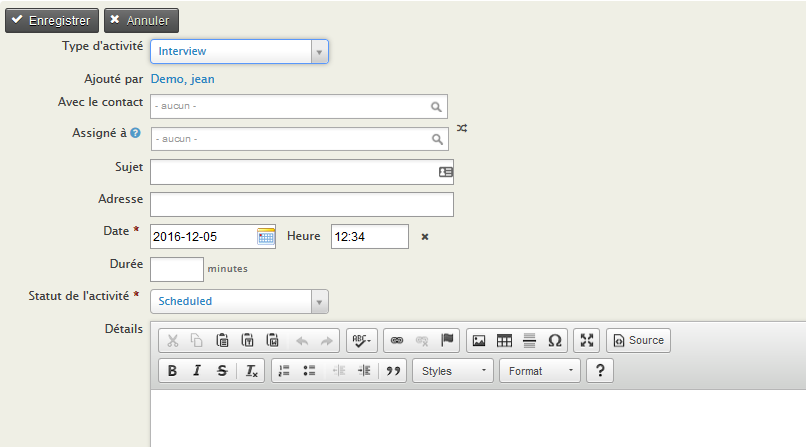
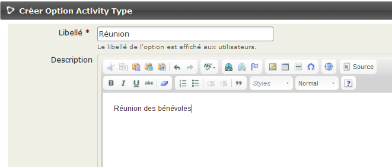
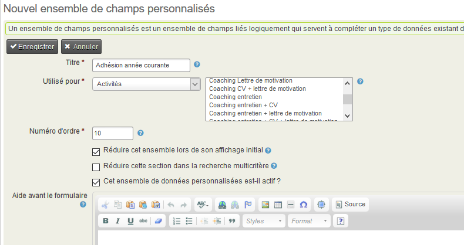
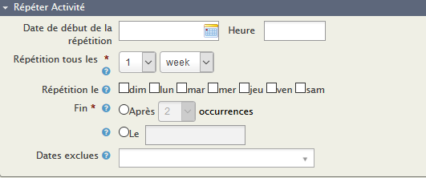

Activités
==========

Les activités sont un concept clé dans CiviCRM, offrant un lieu unifié pour enregistrer et visualiser
l'historique des interactions entre votre organisation et vos membres, entreprises, clients 
et partenaires. Vous pouvez les utiliser pour suivre les réunions, les appels téléphoniques et 
toutes les activités que vous avez mises en place. Les activités sont également utilisées par tous
les composants de CiviCRM pour enregistrer les opérations telles que les cotisations, les contributions,
les participants aux événements, signature de pétitions, etc...

Toutes les activités se déroulent à un moment précis et impliquent au moins un ou plusieurs contacts. 
Les activités peuvent être confiées au personnel ou aux bénévoles, et un courriel est envoyé automatiquement
aux intervenants assignés.

S'il est important pour vous de savoir qui a effectué une tâche dans votre organisation, enregistrez-la comme une activité.

Vous pouvez enregistrer une activité entre un contact donné et plusieurs autres contacts en ajoutant 
autant de contacts que vous le souhaitez dans le champ "Avec contact" du formulaire "Ajouter une activité".

Plusieurs types d'activités sont incluses par défaut, mais vous en pouvez créer autant que nécessaire pour
définir les activités spécifiques effectuées par votre organisation. Vous pouvez les définir dans 
**Administer> Personnaliser les données et les écrans> Types d'activité**. 
Vous pouvez également ajouter des champs personnalisés aux types d'activités pour permettre la collecte de
données spécifiques. Par exemple, vous pouvez créer 2 nouveaux types d'activités appelés: **Formation** et
**Interview** Vous pouvez ensuite configurer un jeu de champs personnalisé qui est associé à ces activités
incluant des informations telles que **Apporteur de fonds** et **Projet**. Cela vous permettrait de produire
des rapports de toutes les activités réalisées pour un apporteur de fonds particulier ou dans le cadre d'un 
projet spécifique. 
Vous pouvez également créer un champ personnalisé qui sera utilisé pour un type d'activité spécifique. 
Par exemple, vous pouvez différentier **réunions** en tant que **réunion de personnel**, **réunion de client**,
**réunion avec d'autres organisations.** etc...  
Pour en savoir plus sur la création de champs personnalisés, reportez-vous au chapitre **Champs personnalisés**.
Pour plus de détails sur la production de rapports, consultez la section **Rapports**. 

Les activités ont les attributs suivants par défaut:

-   **Type d'activité** : Le type d'activité (voir ci-dessous)
-   **Ajouté par** : la personne qui a ajouté cette activité ou le contact qui a effectué l'activitévia le site Web
-   **Avec contact(s)** : les contacts dans votre base de données qui font l'objet de l'activité.
-   **Assigné à** : la personne (habituellement au sein de votre organisation) qui effectuera (ou a effectué) l'activité
-   **Sujet** : Titre de l'activité
-   **Date et heure** : les activités se déroulent toujours à un certain moment
-   **Durée** : vous pouvez enregistrer le temps consacré à une série d'activités
-   **Statut de l'activité** : si l'activité est planifiée, terminée, annulée, etc.

**Activités et groupes**. Il peut y avoir une confusion entre l'utilisation de ces deux catégories.
Par exemple, vous pouvez choisir d'enregistrer une liste d'adhésions envoyé à un contact en tant qu'activité
ou simplement ajouter le contact à un groupe «liste d'adhésion reçu». Cependant, il est préférable d'enregistrer
cela comme une activité. Ensuite, vous pouvez enregistrer quand la liste d'adhésions a été envoyé, qui l'a envoyé,
des notes sur ce que la personne a demandé, etc... Vous pouvez également utiliser l'activité pour planifier
l'envoi de packs d'abonnement en définissant une date et une heure future et en définissant le statut sur «planifié».

**Activités et événements**.  Il s'agit d'une distinction importante. Un événement est une action à laquelle 
un contact assiste, comme une rencontre, une formation, un repas. Une activité peut être tout type d'interaction
entre un contact et votre organisation, une réunion d'information, un appel téléphonique, un don, etc..

Création de nouveaux types d'activités
---------------------------
Aller à  **Administer> Personnaliser les données et les écrans> Types d'activités** et cliquez sur "Ajouter un type d'activité".

Attribuez votre nouveau type d'activité au composant "Contact" si vous souhaitez qu'il soit disponible à partir
du bouton "Actions" lors de l'affichage d'un enregistrement de contact. Assignez-le à "CiviCase" si ces activités
sont seulement à utilisées dans un dossier.

Configuration d'un ensemble de champs personnalisés pour les activités
-------------------------------------------
Lorsque vous configurez un ensemble de champs de données personnalisées, vous devez spécifier les données à utiliser. 
Une des options ici est "Activité" et si vous le souhaitez, vous pouvez préciser quel type d'activité. 
Cela signifie que ces champs de données personnalisés seront disponibles lors de l'enregistrement des activités. 

Options d'état d'activité
-----------------------

Les options d'état par défaut sont

-   Programmé
-   Terminé
-   Annulé
-   Message Gauche
-   Inaccessible
-   Non requis
Si vous avez besoin de plus d'options, vous pouvez en ajouter à partir de **Administer> Paramètres système> Groupes d'options**.

Toutefois, avant d'ajouter trop d'options, n'oubliez pas que toutes les options d'état s'affichent sur tous 
les types d'activité. Alors réfléchissez soigneusement à ce que vous devez ajouter.

Activités répétées
----------------------

Vous pouvez définir une activité à répéter certains jours et heure avec une date de fin spécifique et inclure
des dates à exclure de la répétition.

Dès que vous êtes dans l'**écran d'activité** les options récurrentes peuvent être définies sous **Répéter Activité** 
Les options que vous pouvez définir sont:

-   **Date et heure de début de la répétition**
-   **Repetition Start Date and Time**
-   **Répéter chaque**: Heure, Jour, semaine, Mois, Année
-   **Répéter le **: Dimanche, Lundi, Mardi, Mercredi, Jeudi, Vendredi, Samedi
-   **Fin**: Après un certain nombre d'occurrences ou à une date précise
-   **Exclure les Dates**: Plusieurs dates peuvent être sélectionnées

Une fois l'activité enregistrée, un écran de confirmation s'affiche affichant toutes les dates pour lesquelles 
une activité sera créée. Une nouvelle Activité sera créée pour chaque répétition et pourra être modifiée et
supprimée individuellement.

Lorsque vous modifiez une répétition d'une activité, vous avez la possibilité d'appliquer la modification à
cette activité uniquement, ou à cette activité et à toutes les activités futures de la série ou à chaque 
activité de la série. Les modifications apportées à la date ou à l'heure ne sont PAS appliquées à d'autres activités récurrentes.

