Recherche
=========

Ce chapitre couvre les différentes méthodes pour trouver les informations que vous avez enregistrées dans CiviCRM. 
Vous trouverez ci-après deux techniques de recherche qui sont les fonctions de base dans CIVICRM : la recherche de contacts et la recherche d'action. Les utilisateurs trouvent ces méthodes très utiles.

Nous allons commencer par quelques recherches simples et ensuite passer à des techniques plus avancées. Les débutants de CiviCRM doivent être familiarisés avec la recherche rapide, la recherche avancée et les recherches de composants. Les utilisateurs les plus avancés peuvent également consulter les Rapports, les Recherches personnalisées et le Constructeur de recherche.

Il y a trois raisons principales de faire des recherches :

-   Pour trouver un contact particulier : le champ de recherche rapide peut trouver des contacts par nom, adresse e-mail ou une variété d'autres caractéristiques.
-   Pour effectuer une action sur un ou plusieurs contacts qui répondent à certains critères: la recherche d'action dans CIVICRM permet de trouver des contacts qui répondent à certains critères, puis effectuer une action sur eux. Par exemple, vous pouvez trouver tous les contacts d'un groupe pour les inviter à une réunion, ou tous ceux dont les adhésions ont récemment expiré pour envoyer un rappel de renouvellement ou bien tous les contacts âgés de moins de 25 ans d'une même ville pour envoyer un courriel sur un événement à venir proche du domicile.
-   Pour créer un rapport spécifique : la recherche est souvent utile pour un type de rapport spécifique mais présente des limites. Par exemple, vous ne pouvez pas grouper les résultats par critères particuliers, résumer ou produire facilement des graphiques des résultats. Pour obtenir des rapports plus avancés consultez la section *CiviReport*.

Recherche rapide
--------------

La manière la plus simple de trouver un contact spécifique consiste à utiliser la zone de recherche rapide qui apparaît dans le menu de navigation en haut à gauche de l'écran. Vous pouvez choisir de faire une recherche parmi plusieurs critères. Dès que vous cliquez dans la case, vous pouvez commencer à taper immédiatement pour utiliser la recherche par défaut : "Nom / E-mail".  Vous pouvez aussi cliquer à nouveau pour choisir plusieurs autres critères dans une liste déroulante. Les contacts correspondants au mot que vous entrez apparaîtront dans une liste déroulante sous la boîte.

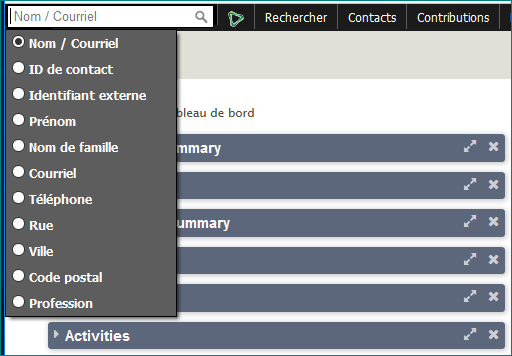

Par exemple, si vous recherchez avec Nom / Email et que vous avez laissé le caractère générique de recherche approximative activé, allez dans **Administer> Personnaliser les données et les écrans> Préférences de recherche** pour vérifier.

Ainsi en entrant "pierre", vous trouverez:

-   Les personnes dont le prénom ou le nom de famille est **Pierre**
-   Les personnes qui ont Pierre comme faisant partie de leur nom, ex. Marie **Pierre** LEBRETON
-   Les personnes qui ont Pierre dans leur adresse électronique, ex. jean.**pierre**@gmail.com
-   les organisations avec Pierre en leur nom, ex.  Association **Pierre** Insertion.

Vous n'avez pas besoin de taper le nom complet de la personne... juste les premières lettres.
Remarque: Si vous effectuez une recherche par **téléphone**, vous devrez entrer les chiffres du numéro de téléphone sans aucun formatage. La recherche de "téléphone" est effectuée sur un champ composé uniquement de chiffres dont tous les caractères non numériques ont été retirés.

Recherche avancée
---------------
La recherche avancée vous permet de rechercher dans toutes les informations que vous avez sur vos contacts. Par exemple, vous pourriez trouver «tous les contacts en Italie» ou «tous les membres du groupe adhérents». Si vous spécifiez deux catégories d'informations ou plus, la recherche affiche tous les contacts correspondant à toutes les catégories. Vous pouvez aussi combiner les deux critères mentionnés pour trouver «tous les membres du groupe adhérents en Italie».

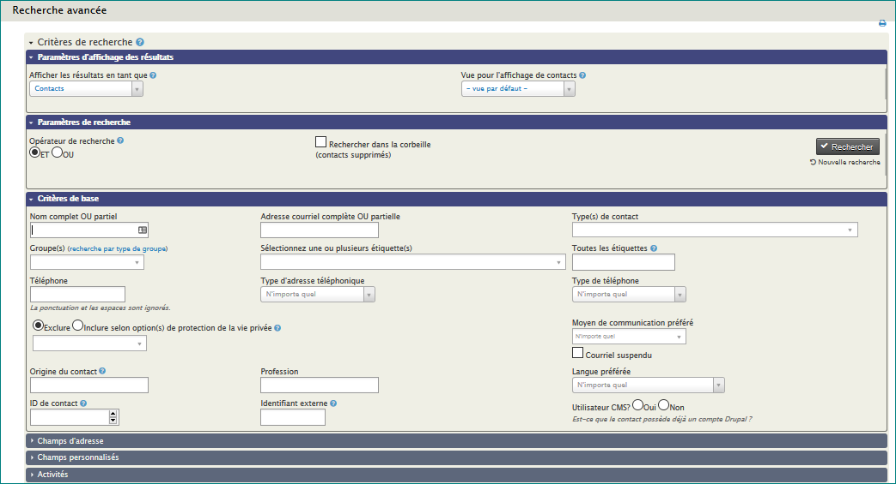

L'écran "Recherche avancée" est accessible depuis le menu de navigation  **Recherche> Recherche avancée**. Sur cet écran, les critères de recherche sont regroupés en sections qui font référence à différents types de données sur lesquelles vous pouvez effectuer une recherche, telles que des données d'adresse, d'activités, de notes et des informations provenant de composants tels que Contributions ou Evénements. Chaque groupe de critères est représenté sous la forme d'une barre bleue (connue sous le nom d'«accordéon» car elle s'élargit lorsque vous cliquez dessus). Par exemple, si vous souhaitez rechercher toutes les personnes de votre base de données de 16 à 18 ans, cliquez sur l'accordéon "Données démographiques". Lorsqu'il s'ouvre, vous pouvez spécifier la période de la date de naissance qui vous intéresse.

#### Paramètres d'affichage des résultats

La Recherche avancée renvoie vos résultats en tant que "Vue par défaut". Vous pouvez obtenir un autre type d'affichage. Par exemple, vous pouvez rechercher sur l'activité Renouvellement d'adhésion pour trouver tous ceux qui ont renouvelé leur adhésion la semaine dernière, puis afficher les résultats sous la forme d'adhésions afin d'exporter le nom, l'adresse et la date d'expiration de l'adhésion et lister les membres concernés. Il suffit alors de sélectionner le type d'affichage souhaité dans la liste déroulante **Afficher les résultats en tant que**.

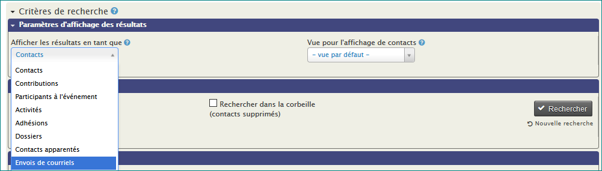

#### Views for Display Contacts

La recherche avancée vous permet de modifier les colonnes affichées dans vos résultats de recherche. Les colonnes par défaut sont Nom, Adresse, Ville, État, Code Postal, Pays, Email et Téléphone. Si vous souhaitez afficher un ensemble différent de colonnes (peut-être pour inclure un champ personnalisé ou supprimer une colonne dont vous n'avez pas besoin), créez un profil avec l'option de vues de recherche sélectionnée. Assurez-vous que les champs Visibilité de ce profil est activé comme "Exposer publiquement et pour les listes", et que le champ "colonne de résultats" soit activé. (Pour plus d'informations sur la création de profils voir le chapitre Profils de la section Configuration.)

Par exemple, vous pouvez inclure des colonnes pour le sexe et la date de naissance, tout en éliminant le pays.

Créez un profil qui inclut la date de naissance, le sexe et les champs d'adresse.

Pour en savoir plus sur la création de profils consultez la section *Profils* du chapitre *Organisation de vos données*.

La combinaison de cette fonctionnalité avec l'action "Mise à jour par lots via profil" fournit une méthode puissante de visualisation et de mise à jour d'un ensemble spécifique de champs d'un lot d'enregistrements de contacts.

### Paramètres de recherche

L'opérateur de recherche détermine si vos critères sont combinés avec des instructions ET ou OU . Par exemple, vous voulez trouver tous les contacts qui font partie du groupe Volontaires ET qui ont une activité de formation des bénévoles. Dans ce cas, utilisez l'opérateur ET. Si vous avez besoin de trouver tous ceux qui sont dans le groupe des Volontaires OU ont une activité de formation des bénévoles, utilisez l'opérateur OR.

La recherche dans la corbeille vous permet de rechercher des contacts qui ont été supprimés mais pas supprimés définitivement. Lorsqu'un contact est supprimé, le contact et toutes les données associées sont déplacées vers la corbeille. Seuls les utilisateurs disposant de la permission appropriée pourront rechercher dans la corbeille et pourront restaurer le contact de la corbeille.

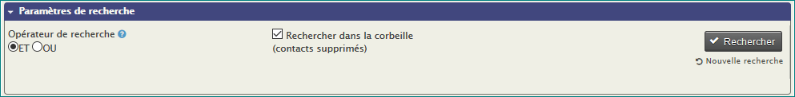

### Le filtre de plage de dates

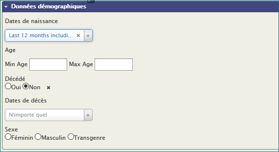

La plupart des recherches dans CIVICRM comprennent un filtre de plage de dates. Les images ci-dessous montrent deux exemples:

-   En utilisant une plage de dates absolue, ex. "1er Jan 2010" au "31 juillet 2010"
-   En utilisant une plage de dates relative, ex. "Semaine précédente"

Les plages de dates relatives sont particulièrement utiles pour les recherches que vous souhaitez enregistrer sous forme de groupes intelligents (groupes remplis automatiquement qui sont configurés pour inclure des contacts qui partagent un certain ensemble de caractéristiques ou d'activités). Pour plus d'informations, reportez-vous au chapitre *Groupes et étiquettes*.

Par exemple, vous pouvez utiliser une recherche relative à la période pour trouver:

-   Contacts ayant contribué au cours des 7 derniers jours (intervalle de date relatif : "Depuis 1 semaine")
-   Les participants aux événement de l'année (Période de référence : «Cette année»)
-   Les contacts qui ont un certain âge

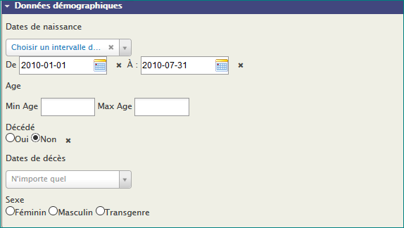

Les filtres de dates relatives basés sur l'intervalle de temps «semaine» supposent que dimanche est le premier jour de la semaine. Ce n'est pas vrai dans tous les pays, par exemple en Europe et dans de nombreux pays de la région Asie / Pacifique le lundi est le premier jour de la semaine. Pour définir quel est le premier jour de la semaine, vous devez aller à **Administrer >> Localisation >> Format de date**.

#### **Combinaison des critères de recherche**

Certains critères peuvent être combinés par "ET". Par exemple, si vous sélectionnez l'étiquette «donateur» et le pays «Italie», la recherche renverra les principaux donateurs d'Italie. La recherche ne renverra pas les  donateurs qui ne sont pas *d'Italie*, ni ceux d'Italie qui ne sont pas *donateurs*.

Vous pouvez modifier l'opérateur de recherche par défaut de ET par OU dans les paramètres de recherche.

Dans les groupes de critères qui vous permettent de cocher des cases pour plus de valeurs, ces options sont également combinées par "ET". Par exemple, si vous pouvez rechercher des contacts dont le Moyen de communication préférée est à la fois E-mail *ET*  SMS.

Avec des champs qui vous permettent de sélectionner plus d'une valeur dans une liste déroulante, les valeurs sont toujours combinées avec "OU". Par exemple, vous pouvez trouver des contacts qui vivent en Italie ou en Espagne.

Constructeur de recherche
-------------------------

Ce constructeur de recherches permet de choisir parmi un large éventail de critères dans un panneau convivial, mais cela a des limites. Vous pouvez de définir votre propre recherche et d'organiser les critères en fonction de vos besoins spécifiques. Cette recherche permet d'utiliser les opérateurs suivants :

| Opérateur  | Action | Exemple |
| ------ | ------ | ----- |
| = | Egal. Correspond à la valeur exacte spécifiée | **"Prénom" = "Bob"** Trouvera les contacts dont le prénom est exactement "Bob"|
|  ≠  | Différent. Correspond à tout ce qui n'est pas la valeur indiquée. | **"Genre" ≠ "Femme"** Trouvera les contacts qui ne sont pas des femmes |
|  > , ≥  | Plus grand que, plus grand ou égal | **"Date de naissance" ≥ "1 Janvier 2000"** Trouvera les contacts nés après le 01 janvier 2000 |
| < , ≤ | Plus petit que, Plus petit ou égal | **"Nom" < "J"**  Trouvera des contacts dont le nom commence par une lettre qui vient avant J dans l'alphabet | 
| In | La valeur est l'une de celles que vous spécifiez | **"Groupe" in "Membres du Conseil, Bénévole"**  trouvera les contacts qui sont dans l'un des groupes spécifiés |
| Like| Identique à = mais prend en charge le caractère caractère générique % |**"Nom" like "Dup%"** trouvera les contacts dont le nom de famille commence par "Dup" (Dupont, Dupré, etc) | 
| Regex | Identique à =  mais prend en charge tous les opérateurs d'expressions régulières. Voir : http://en.wikipedia.org/wiki/Regular_expressions | **"Prénom" Regex "[a-c]"** trouvera des contacts dont l'initiale du milieu est A, B ou C
| Is Empty, Not Empty| Empty signifie que le champ existe et est égal au nombre zéro ou ne contient rien | **"Ville" is empty**  trouvera tous les contacts qui ont une adresse mais la ville a été laissée vide │
| Is Null, Not Null | Null signifie que le champ n'existe pas ou ne contient rien. | **"Ville" is Null**  trouvera tous les contacts qui n'ont aucune adresse |

Vous pouvez également combiner des critères de recherche avec plusieurs groupes AND et OR. Pour les critères AND (ce qui signifie de trouver les résultats correspondant à tous les critères spécifiés), cliquez sur **Autre champ de recherche** et entrez les critères sous **Inclure les contacts pour lesquels**. Pour les critères OU (c'est-à-dire pour trouver des résultats correspondant à l'un OU à l'autre critère), entrez un critère dans **Inclure également les contacts pour lesquels** et l'autre sous **Inclure également les contacts où**.
L'exemple suivant recherchera des femmes nées après le 01 janvier 2000 OU membres du groupe"Amis du cinéma":

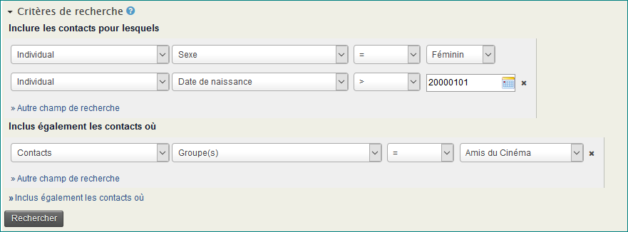

Vos résultats de recherche contiendront le nom de chaque contact, ainsi qu'une colonne pour chaque critère de recherche que vous avez défini. Si vous exportez des résultats de recherche, le fichier d'exportation contiendra ces mêmes colonnes.

Tout comme les autres recherches, vous pouvez choisir parmi une liste d'actions à appliquer aux résultats de votre recherche. Si vous exportez des résultats, vous pouvez sélectionner les champs à exporter. Notez que les champs que vous avez recherchés seront exportés par défaut en plus de ceux que vous avez sélectionnés.

Vous pouvez également enregistrer votre recherche comme "groupe intelligent". Pour plus d'informations sur les groupes intelligents, reportez-vous au chapitre *Groupes and Etiquettes *.

Recherche textuelle  
------------------

Vous pouvez utiliser cette option pour rechercher des valeurs de texte dans tous les champs de la base de données. Ceci est particulièrement utile. Exemple, si vous vous souvenez de mots spécifiques que vous avez utilisés mais dont vous ne vous rappelez pas à qui ils ont été attribués. Par exemple, vous avez enregistré une activité à un contact et ajouté des mots spécifiques dans la description, ... mais vous avez oublié le nom du contact!  Vous pouvez utiliser la recherche textuelle pour trouver le contact et l'activité, uniquement par les mots que vous avez utilisés dans la description.

Recherche de composants
------------------

La plupart des composants CiviCRM proposent une recherche sur leurs propres données, comme **Trouver des contributions**, **Trouver des membres**, etc. Ces formulaires fonctionnent de manière similaire à la  **Recherche multicritères**  mais renvoient des lignes du fichier principal associé aux composants, au lieu des contacts. **Trouver des membres** retourne des adhésions, **Trouver des participants** montre les inscriptions aux événements, **Trouver des contributions** retourne les contributions et ainsi de suite.

Chaque recherche de composant possède sa propre liste d'Actions. Voir les sections *Composant* pour plus de détails.

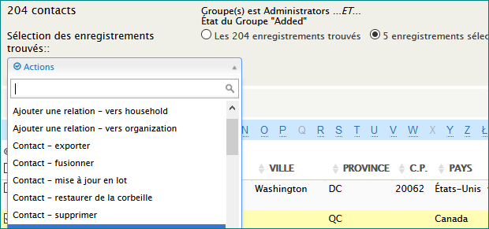

Notez que vous pouvez également utiliser la recherche multicritères en association avec **Afficher les résultats sous** pour rechercher en fonction des critères disponibles dans la recherche avancée. Par exemple, vous pouvez trouver tous les présents aux événements à partir des contacts qui sont également membres.

Recherche personnalisées
------------------------

Les recherches personnalisées sont conçues pour répondre à des besoins spécifiques qui ne peuvent être facilement résolus en utilisant **Recherche avancée** ou **Constructeur de recherche**.

Dans le menu de navigation accédez à **Recherche**> **Recherche personnalisées**, vous verrez la liste des recherches personnalisées disponibles. Ces recherches personnalisées ont été écrites par des membres bénévoles de la communauté CiviCRM pour répondre à leurs propres besoins. Vous pouvez aussi partager les votres avec la communauté dont les besoins sont similaires. Prenez le temps d'explorer ces recherches dont certaines peuvent vous être utile et vous donneront une idée de ce qui est possible. 

Bien que certaines de ces recherches puissent être effectuées dans le cadre de la Recherche avancée (surtout dans les versions ultérieures), des recherches personnalisées sont déjà configurées et prêtes à être utilisées pour afficher des résultats en fonction de vos besoins et peuvent proposer plus de colonnes utiles. 

Voici une brève description des recherches personnalisées disponibles :

### Trouver des contacts dans un groupe mais pas dans un autre

C'est probablement la recherche personnalisée la plus populaire.

Lorsque vous utilisez la recherche avancée, si vous sélectionnez plusieurs groupes dans la liste de groupes, le traitement d'effectuera comme une recherche OU et renverra les résultats pour les contacts appartenant à l'un des groupes que vous sélectionnez. Si vous souhaitez trouver des contacts appartenant à tous les groupes sélectionnés, vous devrez utiliser le Constructeur de recherche.

Il existe également une recherche personnalisée intégrée très utile, «Inclure / Exclure des contacts dans un groupe ou une étiquette», qui vous permet de trouver des contacts qui se trouvent dans un groupe mais pas dans un autre. Vous la trouvez en allant à **Rechercher > Recherches personnalisées** dans le menu de navigation.

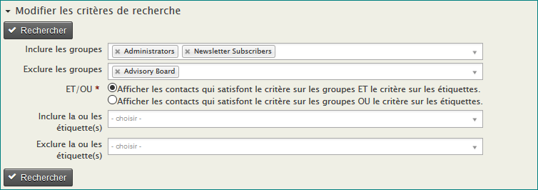

En combinant les options Inclure et Exclure, vous pouvez trouver des contacts qui se trouvent dans un groupe, mais exclure uniquement les membres du groupe qui correspondent à un autre critère. Par exemple, vous pouvez trouver tous les contacts qui sont abonnés à la newsletter ou des bénévoles, et exclure les membres du conseil d'administration, peut-être pour créer une nouvelle liste de diffusion pour envoyer un message ciblant les cercles les plus externes de vos contacts.

### **Nom et statut des ménages**

Rechercher des ménages dans un état ou une province.

Remarque: les états ou provinces disponibles dans la recherche dépendent de vos paramètres de localisation. Ajoutez d'autres pays en allant à **Administer**> **Configurer**> **Paramètres globaux**> **Localisation**. Ajoutez à la colonne «États et provinces disponibles», mais notez que cette modification aura également une incidence sur les formulaires de profil qui comprennent les champs de pays ou d'état / province.

### **Total cumulé des Contribution**

Trouver les totaux cumulés des contributions des contacts dans une plage de dates.

### **Envoi postal**

Rechercher des contacts dans un groupe donné et afficher les résultats avec des informations de diffusion. Profitez de cette recherche pour mettre à jour les informations de contact par lots, envoyer un courrier électronique, exporter des contacts ou d'autres actions.

### **Recherche de proximité**

Recherche de contacts situés à moins de x miles / kilomètres d'un lieu géographique spécifique.(rue, ville,code postal)

1. Allez à **Rechercher> Recherches personnalisées> Recherche de proximité**
2. Entrez la distance en miles ou en kilomètres.
3. Entrez le nom de la rue, la ville, le code postal, le pays dans lequel vous voulez effectuer la recherche.
4. Entrez les autres paramètres (groupe, étiquette) que vous souhaitez affecter à votre recherche.
5. Cliquez sur **Rechercher**.

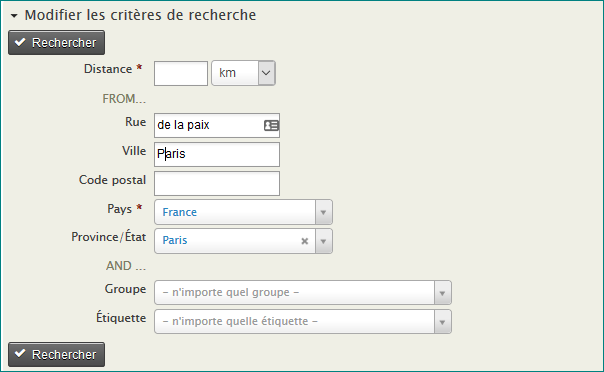

**CONSEIL :** Vous pouvez également incorporer la recherche de proximité dans un profil que vous avez configuré pour être utilisé comme formulaire de recherche.

### **Total des événements**

Rechercher des paiements liés à des événements pour un événement ou un type d'événement donné dans une période donnée. Vous pouvez également limiter les résultats pour afficher uniquement les paiements par carte de crédit ou les bénéficiaires. Voir aussi les rapports d'événements pour des options de recherche d'événements plus utiles.

### **Recherche d'activités**

Trouver des activités en utilisant l'un ou l'ensemble des critères liés à l'activité. Cela est également possible dans Recherche multicritères en utilisant Affichage des résultats sous...

### **Détails des tarifs pour les participants aux événements**

Obtenez des informations détaillées sur les participants qui ont opté pour les différents choix payants liées à un événement. Par exemple, voir qui a payé la participation, qui a payé pour l'atelier supplémentaire ou qui a payé pour le dîner.

### **Trouver les montants de cotisations par étiquettes**

Rechercher sur toutes étiquettes les contributions dans une plage de dates.

### **Plage de code postal**

Trouvez des contacts dans une zone de code postal ou de code postal spécifiée. Cela est utile pour les envois ciblés ou pour mener des enquêtes dans une zone géographique particulière.

1. Allez à **Rechercher> Recherches personnalisées> Plage de code postal**.
2. Saisissez la plage de début et de fin du code postal ou des codes postaux.
3. Cliquez sur **Rechercher**.

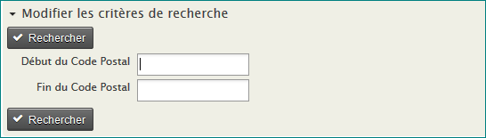

### **Date d'ajout à CiviCRM**

Rechercher des contacts qui ont été ajoutés au cours d'une période donnée. L'inclusion d'un groupe affiche uniquement ceux qui sont ajoutés dans le délai spécifié et qui sont également dans ce groupe. En excluant un groupe, les membres du groupe sont exclus de ces résultats.

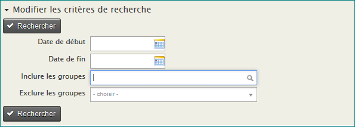

### **Liste des valeurs multiples de groupe personnalisé**

Recherche de données personnalisées à plusieurs valeurs.

### **Contributions effectuées dans l'année X et non dans l'année Y**

Rechercher les contributions qui ont été faites dans une année et pas dans une autre. Cela est utile pour suivre les donateurs semi-réguliers et les encourager à faire un don plus régulièrement. Voir aussi les rapports LYBUNT et SYBUNT.

Aucun des champs n'est requis. Vous pouvez choisir de rechercher une plage de montant spécifié ainsi qu'une période de temps et si vous souhaitez exclure des montants minimum ou maximum.

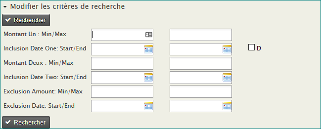

Il est possible d'écrire vos propres recherches personnalisées, mais vous devrez être à l'aise avec MySQL et PHP. Voir le wiki de développeur à [http://wiki.civicrm.org/confluence/display/CRMDOC/Develop](http://wiki.civicrm.org/confluence/display/CRMDOC/Develop)  pour plus d'informations sur la façon de faire. Si vous créez une recherche personnalisée qui pourrait être utile à d'autres utilisateurs, pensez à la partager avec la communauté.

Utiliser "recherche + action"
----------------------------

Après avoir récupéré vos résultats de recherche, vous pouvez effectuer un certain nombre d'actions. Une zone Actions s'affiche au-dessus des résultats. Vous pouvez sélectionner tous les enregistrements ou cocher uniquements ceux qui vous interessent pour effectuer une action avec les enregistrements seulement sélectionnés. Les différentes actions sont traitées plus en détail dans le chapitre sur les tâches quotidiennes.

Les actions les plus couramment utilisées sont Add Contacts to Group, Export Contacts, Map Contacts, et créer et imprimer des Mailing Labels. (Pour utiliser Map Contacts, vous devez configurer Mapping and Geocoding. Pour en savoir plus, consultez le chapitre *Installation* de la section *Configuration* de ce manuel).
Par exemple, pour envoyer un courriel à un certain nombre de contacts, cochez les contacts qui vous intéressent, puis sélectionnez **Envoyer un e-mail aux contacts** dans la liste déroulante des actions.

La fenêtre du résumé des contacts
--------------------------
Cette boîte de dialogue contextuelle contient des informations détaillées pour tout contact figurant dans vos résultats de recherche en cliquant sur l'icône de contact dans la colonne de gauche, comme indiqué ci-dessous. Vous pouvez ajuster les champs affichés dans cette "fenêtre contextuelle" en modifiant les champs inclus dans le profil "Résumé de la superposition" (**Administer **> ** Personnaliser les données et les écrans**> **Profils**).

Le caractère générique (%)
----------------

L'utilisation du caractère caractère générique (%) augmente considérablement vos options de recherche. Un caractère générique représente tout caractère (lettre, chiffre ou signe de ponctuation). Dans CiviCRM, le caractère générique est représenté par le symbole "%" (dans d'autres application c'est souvent * ) . Voici un exemple : 

Supposons que l'on vous a demandé de trouver un contact avec un prénom tel que "Michael", mais aussi se rapprochant de "Michelle" ou "Michal". Si vous recherchez "Mich%" vous trouverez toutes les variations, y compris un contact qui est censé être nommé "Michael" mais dont le nom a été mal orthographié comme "Micheal". Les caractères génériques peuvent être utilisés avant, après ou même avec des mots. Par exemple, la recherche sur 'Mich% el' exclura "Michał" et "Micheal" mais trouvera "Michelle" et "Michael".

Sensibilité à la casse
------------------
Notez que lorsque vous recherchez des chaînes de caractères, la recherche n'est pas sensible à la casse. Par exemple, si vous recherchez 'brooklyn', la recherche renverra des chaînes avec des lettres majuscules si la chaîne existe.
Ex. «Brooklyn» ou «BROOKLYN». Saisir "mi%el" en minuscules trouvera également des contacts avec un majuscule 'M' dans leur nom.

