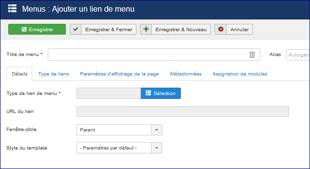
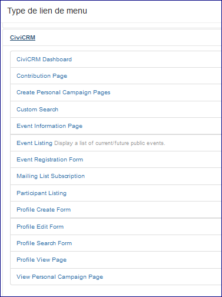

Intégration avec Joomla!
=======================

CiviCRM s'intègre très facilement à Joomla! En tant que composant.
Les formulaires publics CiviCRM tels que les pages de contribution en ligne et les pages d'inscription des événements peuvent être intégrés comme éléments de menu sur le front-end de votre site Joomla!, en utilisant votre thème personnel. Lorsque vous êtes connecté en tant qu'administrateur, CiviCRM est affiché comme élément de menu sous "Composants".

Creating Joomla! Menu Items for CiviCRM Content
-----------------------------------------------
Le contenu de CiviCRM peut être affiché sur votre site Web de deux manières différentes. La façon principale est de créer un élément de menu spécifique qui affichera les données de CiviCRM. Dans Joomla! Menu, naviguez jusqu'à **Menu principal-> Ajouter un lien de menu**.

Dans cet écran sélectionner le "type de lien de menu". Un nouvel écran affichera  les options ci-dessous  en cliquant sur Civicrm. 

Sélectionner la page CiviCRM correspondante à ce que vous souhaitez afficher.

- **Contribution Page:** Une contribution spécifique ou une page d'adhésion que vous souhaitez publier sur votre site.
- **Créer des pages de campagne personnelles:** Ce type de lien direct permet aux utilisateurs finaux de créer une page de campagne personnelle liée à une page de contribution spécifique pour la collecte de fonds entre pairs. Par exemple, si vous avez fait un appel de fonds annuel appelé "Support CiviCRM" et que vous vouliez permettre à vos membres de collecter de l'argent en votre nom, vous pouvez créer un élément de menu qui les relient directement
- **Voir la page de campagne personnelle **
- **Recherche personnalisée:** Les recherches des membres peuvent être créées
- **Tableau de bord CiviCRM:** La sélection de cette option permet de montrer à l'utilisateur final toutes ses informations connexes, c'est-à-dire les contributions précédentes, les adhésions actives et périmées, les enregistrements d'événements, etc. Lors de la sélection du tableau de bord CiviCRM, vous assurez-vous que le niveau d'accès pour cet élément de menu est défini comme Enregistré parce que CiviCRM doit savoir à qui afficher exactement les informations. Ainsi, l'utilisateur final en se connectant pourra voir toutes les informations spécifiquesle concernant
- **Calendrier des événements:** Cette option affiche tous vos événements actuels et les place dans une vue d'agenda pour votre utilisateur final.
- **Page d'information sur l'événement:** Ce type d'élément de menu fournit les informations récapitulatives d'un événement que vous avez sélectionné et fournit un lien pour s'enregistrer directement.
- **Liste des événements:** Affiche tous les événements à venir dans un format de liste. Vous avez la possibilité de trier par colonnes, mais il n'y a pas de fonctionnalité de recherche par défaut sur la liste des événements.
- **Formulaire d'inscription à l'événement:**
- **Liste des participants:** Si vous avez activé une liste de participants pour un événement spécifique, vous pouvez afficher qui assistera à votre événement en sélectionnant cette option.
- **Abonnement à la liste de diffusion:** Si vous avez configuré des groupes en tant que listes de diffusion et que vous avez défini la visibilité publique, les utilisateurs finaux peuvent s'inscrire à directement à ces listes de diffusion.
- **Formulaire de création de profil:** Vous pouvez collecter des informations complémentaires sur vos visiteurs
- **Formulaire d'édition de profil:** Si un utilisateur final est connecté à votre site et que vous présentez un formulaire d'édition de profil, vous pourrez visualiser les informations que votre organisation a enregistrées. En plus de cela, ils pourront modifier cette information et l'enregistrer dans CiviCRM. Par exemple, si vous présentez le profil **Nouveau Individual** sur votre site Web en tant que formulaire de modification de profil, l'utilisateur final connecté aura alors la possibilité d'afficher et de mettre à jour son prénom, son nom et son courrier électronique et l'enregistrer dans votre instance CiviCRM.
- **Formulaire de recherche de profil:** Si vous avez configuré un profil en tant que formulaire ou répertoire autonome, vous avez la possibilité de donner à l'utilisateur final la possibilité de rechercher dans votre base de données via ce profil spécifique. Par exemple, si vous souhaitez fournir un répertoire de vos membres au public, vous pouvez créer un groupe appelé Membres, puis créer un profil qui limite les résultats de la recherche uniquement aux personnes ou organisations de ce groupe.
- **Formulaire de vue du profil:** Ce type d'élément de menu vous permet d'afficher les informations que vous avez enregistrées pour un utilisateur connecté. Par exemple

Access Levels with CiviCRM Menu Item Types
-------------------------------------------

An important thing to consider is that some of the Menu item types above
require an end user to be logged into you site so that CiviCRM can know
which contact record's information should be presented. For example, if
John Smith comes to your website and is browsing without being logged in
and you have a **Profile View Form** specified to have the access level
of Public, CiviCRM will be completely unaware that John Smith is on your
site and thus not have the ability to display John Smith's personal
information back to him. In this scenario CiviCRM would present the
following error:Every Joomla!
user that is created has a corresponding contact within CiviCRM. So when
someone logs in with their Joomla! credentials, CiviCRM can guarantee
which contact's information to display. The following CiviCRM Menu Item
types require an end user to be logged in to Joomla! and thus when
creating these specific types they should have a minimum Access level
set to Registered.

-   Profile Edit Form
-   Profile View Form
-   CiviCRM Dashboard

The availability of additional modules to extend and modify CiviCRM
behavior is fairly limited. However Joomla integrators have full access
to the CiviCRM API's and hook system, and there are a number of 3rd
party tools designed to solve specific problems and make customizations
easier. 

For more information, developers can refer to the 3rd party module
listing on the wiki: 
[http://wiki.civicrm.org/confluence/display/CRMDOC/Joomla!+Extensions+for+CiviCRM+(3rd+party)](http://wiki.civicrm.org/confluence/display/CRMDOC/Joomla!+Extensions+for+CiviCRM+%283rd+party%29)

 
… as well as the online Developer Guide: 
[http://wiki.civicrm.org/confluence/display/CRMDOC/Develop](http://wiki.civicrm.org/confluence/display/CRMDOC/Develop)
